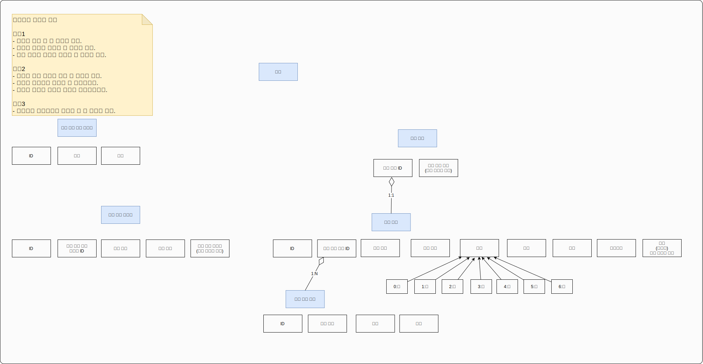

# 쿠쿠리 루틴

기본적으로 루틴을 만드는 것으로 진행하는 프로젝트 입니다.

프로젝트 참석자는 총 5명으로
메인 기여자가 대부분 기여하지만
나머지 인원은 기여하고 싶은 만큼 기여하면 되므로
부담없이 진행하는 것을 목표로 하고 있습니다.

- 프로젝트의 특징
  - 처음에는 아--주 단순한 기능만 만들어 본다(복잡한 기능 만들지 말기!)
  - 기여도 0.00001%만 이상이라면 문제 없음

## Layout

## Use Case

### Detail

## 쿠쿠리 루틴

### domain

## 쿠쿠리 디데이

- 진행중

## 쿠쿠리 일기

### 개요

- 항상 일기쓰기는 작심삼일
- 좋은 추억들을 간직하고 싶은 마음은 가득
- 처음은 단순하고 쉽게 작성할 수 있는 일기라면 어떨까?
- 기분, 기록 이 두가지만 작성해봅시다

## 그 외

- 로그인 구현
  - 별도 프로젝트(쿠쿠리 ID)에 의존하고 있고 jwt를 발급 받고 있음
